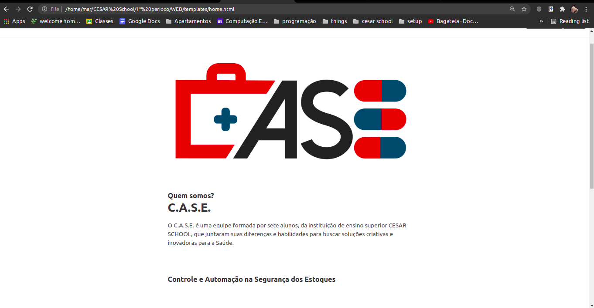
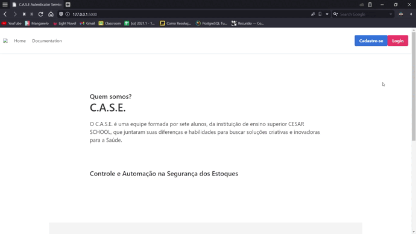

<h1 align="center">C.A.S.E</h1>

  O Projeto&nbsp;&nbsp;&nbsp;|&nbsp;&nbsp;&nbsp;
  Formulários&nbsp;&nbsp;&nbsp;|&nbsp;&nbsp;&nbsp;
  Links&nbsp;&nbsp;&nbsp;|&nbsp;&nbsp;&nbsp;
  Tecnologias&nbsp;&nbsp;&nbsp;&nbsp;&nbsp;&nbsp;

---

## 📝 O Projeto

Este repositório foi elaborado durante o primeiro semestre de 2021 pela equipe de ciências da computação de estudantes da CESAR School na cadeira de Projetos. Buscando uma maior segurança e administração das farmácias hospitalares, o CASE tem objeto fazer o controle do estoque e de permissões de entrada.
 

Membros de ciências da computação da equipe:

- [Lucas Borges Dalcin](mailto:lbd2@cesar.school),   [Maria Luiza Dantas](https://www.linkedin.com/in/maria-luiza-dantas/)

- [Mar Galdino](https://www.linkedin.com/in/mariana-galdino-059243174/)

Membros de design do grupo Simplifica+ :

- [Mariana Santana](mailto:mfs3@cesar.school),   [Matteo Gomes](mailto:mgs3@cesar.school)

---

## :ballot_box: Formulários

## :link: Links

[:link: Link para o protótipo de alta fidelidade.](https://www.figma.com/file/SLibc3oS1XhGEmm6gW81h6/Prot%C3%B3tipo-Alta-CASE?node-id=0%3A1 )

[:link: Link para o dossiê.](https://drive.google.com/file/d/1F7CiMHK3OnJ38r3COmckU5WfJrL8nn1O/view)

[:link: Link para a apresentação.](https://www.figma.com/file/38ykPtfCT5UfhWhMNiKEFs/STATUS-REPORT-3---GRUPO-P-OK?node-id=0%3A1)

---

## 💻 Tecnologias

### Ferramentas

- Visual Studio Code

- Bulma (HTML/CSS/JS)

- Flask

### Linguagens

- Python

  

---

by C.A.S.E - Controle e Automação na Segurança de Estoque

